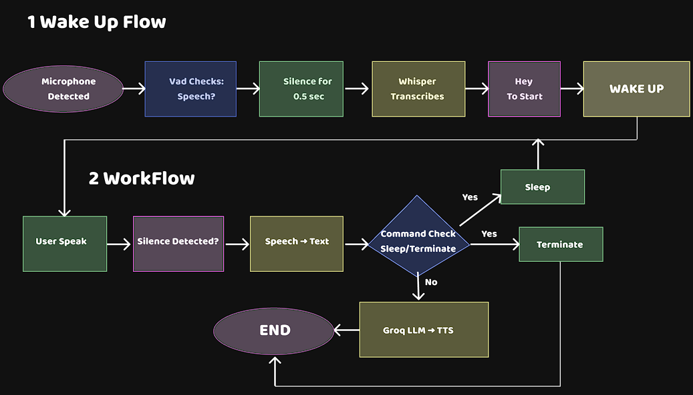

# AnswerBot - Real-Time AI Voice Assistant

AnswerBot is a real-time AI voice assistant that listens to your voice, understands what you said using speech-to-text, generates a smart reply using a large language model, and then answers you back with both voice and animated text. Everything runs on your own laptop, and it's built in a modular way so you can easily change or upgrade any part.

It uses Faster-Whisper for transcription, Groq Cloud API for fast LLM responses, and Edge-TTS for natural-sounding voice output.

## Features

- Wake-word activation: It only wakes up when you say "Hey", "Start", or "Continue".
- Speech-to-Text: Uses Faster-Whisper, optimized for CPU with INT8 quantization.
- LLM Brain: Connects to Groq Cloud API (Llama 3 or GPT-OSS) for quick replies.
- Neural Text-to-Speech: Uses Microsoft Edge-TTS to produce realistic voice.
- Animated TUI: Text appears in a typewriter style using the rich library.
- Voice Commands: You can control the assistant using natural voice commands.
- Secure: API keys are stored in a .env file and never pushed to GitHub.
- Fast: Uses the uv package manager for quick installs.

## Project Structure

AnswerBot/     
├── src/    
│ ├── init.py   
│ ├── audio_input.py   
│ ├── transcriber.py    
│ ├── llm_hub.py    
│ ├── tts_engine.py     
│ ├── ui_output.py  
│ └── shadow_listener.py    
├── .env    
├── .gitignore  
├── config.py   
├── main.py     
├── requirements.txt    

## Installation and Setup

```bash
git clone https://github.com/KartikSaxena19/AnswerBot.git
cd AnswerBot
uv venv
.venv\Scripts\activate
uv pip install -r requirements.txt
```

```bash
.env
LLM_PROVIDER=groq
GROQ_API_KEY=gsk_your_actual_key_here
LM_STUDIO_URL=http://localhost:1234/v1
```

```bash
uv run main.py
```

## Voice Commands
AnswerBot understands three types of voice commands:
- Activate: "Hey", "Start", "Continue" - wakes up the assistant.
- Pause: "Pause", "Exit", "Quit", "Goodbye" - returns to sleep mode.
- Terminate: "Deactivate", "Terminate", "Shut down" - closes the program.

## How It Works - Full Workflow

